<h3><code>talha@github ~ $ whoami</code></h3>

<table>
  <tr>
    <td valign="top" width="370">
      
    </td>
    <td valign="top" width="490">
      
    </td>
  </tr>
</table>

 

<h3><code>talha@github ~ $ ./contributions.sh</code></h3>

  

<h3><code>talha@github ~ $ cat tech_stack.json</code></h3>

  
  
  
  
  
  
  
  
  
  

 

<h3><code>talha@github ~ $ ./featured_projects.sh</code></h3>

<table>
  <tr>
    <td width="33%" valign="top">
      <h4 align="center">🩺 Bioos</h4>
      
<b>Full-Stack Medical AI Analysis</b>

      
7-stage verifiable clinical reasoning pipeline with FHIR/LOINC &amp; multi-agent consensus.

      
<code>Next.js</code> · <code>Gemini 2.5</code> · <code>Vectordb</code>

    </td>
    <td width="33%" valign="top">
      <h4 align="center">👗 Feron</h4>
      
<b>AI Digital Wardrobe &amp; Stylist</b>

      
Smart outfit generation with automated background matting and WASM resilience.

      
<code>Next.js</code> · <code>Python</code> · <code>WASM</code>

    </td>
    <td width="33%" valign="top">
      <h4 align="center">🤖 Robotoy</h4>
      
<b>Interactive AI Family Assistant</b>

      
End-to-end hardware &amp; mobile robotic assistant. ANTSPARK 3rd · TÜBİTAK approved.

      
<code>Fusion 360</code> · <code>RPi 5</code> · <code>Flutter</code>

    </td>
  </tr>
</table>

 

<h3><code>talha@github ~ $ ./links.sh</code></h3>

  
  
  
  

